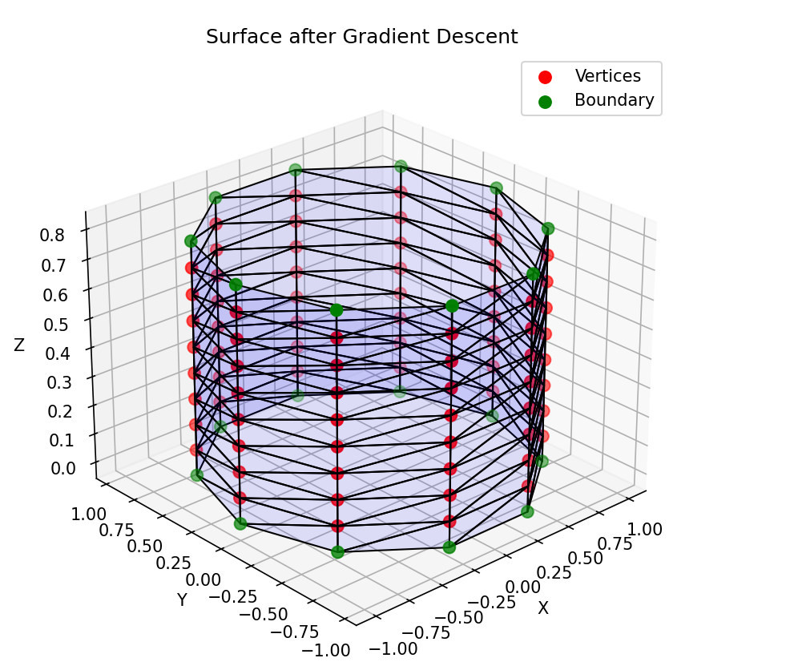
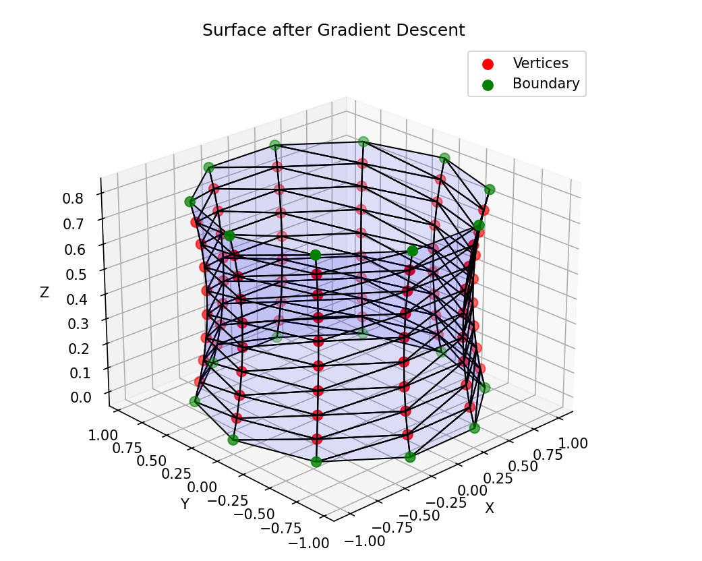

# Pure Mathematics MSc Project Repo

## 📖 Overview
This repository contains the code and computations accompanying my MSc dissertation  
**“Min–Max Methods for Computing Planar Widths and Connections to the Allen–Cahn PDE”**  
at Imperial College London, supervised by **Prof. Marco A. M. Guaraco**.

The project develops a unified **min–max** framework connecting:
- **Linear spectral theory**: min--max construction of eigenvalues  
- **Geometric widths**: nonlinear analogues of eigenvalues for length/volume functionals  
- **Allen–Cahn PDE**: variational formulation and min–max solutions

- Linear spectral theory (min--max construction of eigenvalues)  
- Geometric widths (nonlinear analogues of eigenvalues for length/volume functionals)  
- The Allen--Cahn variational PDE and its min--max solutions

## Contents
This repo includes numerical implementations (via Finite Element Methods, FEM) for two problems:

1. **Minimal Surface Evolution via the Area Functional**  
   _Folder:_ `minimal_surface_evolver`
   _Goal:_ evolve surfaces toward critical points of the area functional using gradient descent.

2. **Planar Width Exploration via the Allen–Cahn Energy**  
   _Folder:_ `allen_cahn_pde_solver`  
   _Goal:_ solve the Allen-Cahn Equation, a variational PDE, by finding min--max critical points of its associated energy via the mountain--pass algorithm.

## Quick Start
Clone:
```bash
git clone https://github.com/SiddharthBerera/MScPureMathsProjectRepo.git
cd MScPureMathsProjectRepo

---

## 📂 Repository Structure
MscPureMathsProjectRepo/
│
├── allen_cahn_pde_solver/ # Allen–Cahn PDE solver (Finite Element implementation)
│ ├── core/ # Core solver modules
│ │ ├── energy/ # Energy functional + Allen–Cahn definition
│ │ │ ├── init.py
│ │ │ └── allen_cahn.py
│ │ │
│ │ ├── fem/ # Finite Element Method routines
│ │ │ ├── init.py
│ │ │ ├── barycentric.py
│ │ │ ├── gradient.py
│ │ │ ├── hessian_dense.py
│ │ │ ├── hessian_sparse.py
│ │ │ └── torch_assembly.py
│ │ │
│ │ └── geometry/ # Domain and geometry definitions
│ │ ├── init.py
│ │ ├── domain.py
│ │ └── planar_domains.py
│ │
│ ├── examples/ # Domains for computing the allen--cahn energy on, the p-parameter min--max solutions would then correspond to the p-widths on this domain - We did not implement the min--maxing
│ │ ├── init.py
│ │ ├── demo.py
│ │ └── square_mesh.py
│ │
│ ├── comparison.py # Benchmarking sparse vs dense Hessian methods
│ ├── setup.py # Packaging/setup script
│ └── allen_cahn_pde_solver.egg-info/
│
├── surface_evolver/ # Minimal surface evolution via area functional
│ ├── core/ # Core routines for curve/surface evolution
│ │ ├── evolver.py
│ │ ├── mesh_utils.py
│ │ └── gradient_descent.py
│ │
│ ├── examples/ # Example runs / test cases
│ │ ├── circle_domain.py
│ │ └── polygon_domain.py
│ │
│ ├── visualization/ # Plotting and interactive tools
│ │ ├── plot_utils.py
│ │ └── animate.py
│ │
│ └── setup.py
│
├── thesis/ # the MSc dissertation
└── README.md

## 📊 Example Visualisations

The following figures illustrate one of the meshes created for discretising surfaces, and its configuration after evolution toward a local minimum of the area functional.  
These outputs demonstrate the convergence of triangulated surfaces toward minimal configurations under the area functional.




- **Red points:** vertices in the evolving mesh  
- **Green points:** fixed boundary vertices  
- **Blue mesh:** triangulated surface evolving toward a minimal surface

